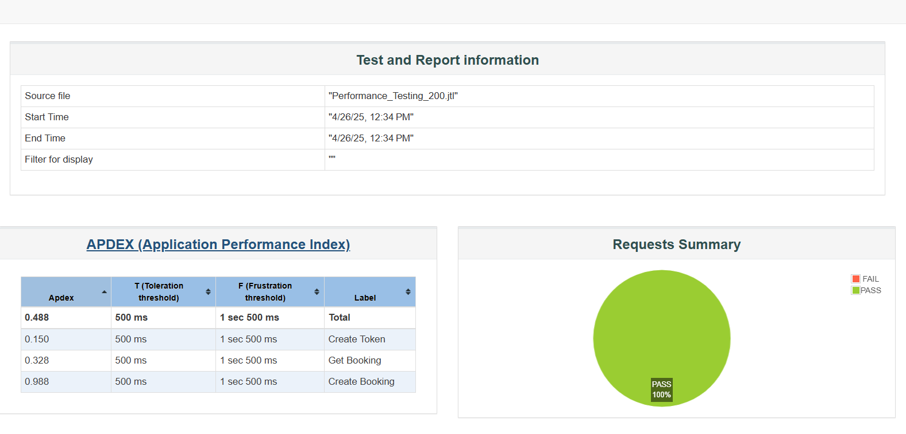
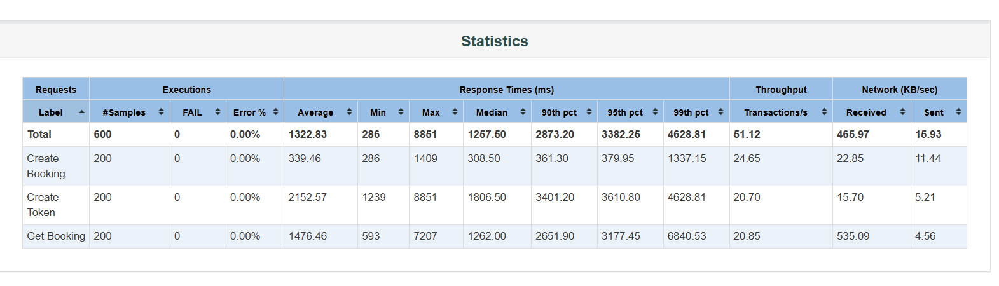
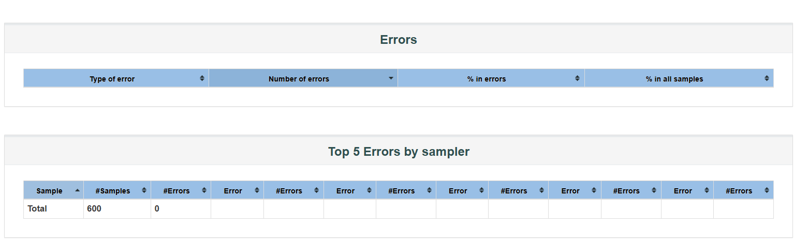

# Performance_Testing_Project
# Performance Testing - Booking Website with JMeter

#

---

## 📖 Introduction
In this project, I conducted performance testing on the [Restful Booker](https://restful-booker.herokuapp.com) website using **Apache JMeter**. The goal was to assess the performance and reliability of its API endpoints under simulated load conditions.

# Testing Site
**Website:** [https://restful-booker.herokuapp.com](https://restful-booker.herokuapp.com)

The following core functionalities were tested:
- Creating a booking (`POST /booking`)
- Retrieving a booking (`GET /booking/{id}`)
- Generating an authentication token (`POST /auth`)

These tests help identify the system’s response behavior, throughput, and performance under varying user loads. Screenshots from JMeter test plans and result listeners are included for reference later.

## 🛠️ Installations & Setup

Before proceeding, make sure you have the following installed:

- **Java:** [Download Java](https://www.oracle.com/java/technologies/javase-downloads.html)
- **Apache JMeter 5.6.3:** [Download JMeter](https://jmeter.apache.org/download_jmeter.cgi)
  - Click → **Binaries**
  - Download → `apache-jmeter-5.6.3.zip`

### Optional Tools:
- [BlazeMeter Chrome Extension](https://chrome.google.com/webstore/detail/blazemeter-the-continuous/mbopgmdnpcbohhpnfglgohlbhfongabi) - Record & export `.jmx` files easily.
- [Lighthouse Chrome Extension](https://chrome.google.com/webstore/detail/lighthouse/blipmdconlkpinefehnmjammfjpmpbjk) - For performance auditing.

---

## 🧰 Prerequisites

- **Java 8+** (Recommended Java 11 or newer)
- **Apache JMeter 5.6.3**
- System Recommendations:
  - 4+ CPU Cores
  - 16 GB RAM (recommended for large user simulations)

---
## ⚙️ Test Plan Configuration

**Create Thread Group:**

- **Number of Threads (Users):** 200
- **Ramp-Up Period (seconds):** 1
- **Loop Count:** 1

**Execution Structure:**

> Test Plan → Thread Group → HTTP Requests → Listeners

---

## 📄 Test Cases

- **Create Booking** (`POST /booking`)
- **Get Booking Details** (`GET /booking/{id}`)
- **Create Token** (`POST /auth`)

---

## ▶️ Test Execution

### Load JMX file:

1. Open JMeter GUI.
2. `File > Open (Ctrl+O)`
3. Choose the corresponding `.jmx` script: `Performance_Testing_200.jmx`

---

### Run Test in Non-GUI Mode:

Open **Command Prompt** inside the JMeter `/bin` folder:

```bash
# For Booking Site
jmeter -n -t Performance_Testing_200.jmx -l report\Performance_Testing_200.jtl
```

---

### Generate HTML Report:

```bash
jmeter -g report\Performance_Testing_200.jtl -o report\Performance_Testing_200.html
```

The HTML reports will be available inside the `report/` directory.

---

## 📷 Screenshots

### 1. Create Booking - JMeter Configuration

| Screenshot | Description |
| :--- | :--- |
|  | Create Booking Request Setup |
|  | HTTP Header Manager Setup |
|  | HTTP Request Defaults Setup |

---

### 2. Result Reports

| Screenshot | Description |
| :--- | :--- |
|  | View Results Tree |
|  | Summary Report |
|  | Aggregate Report |

---

# 📊 Conclusion

Using **Apache JMeter**, I successfully simulated different loads on the Booking website and generated reports that help assess the application's stability and scalability.


